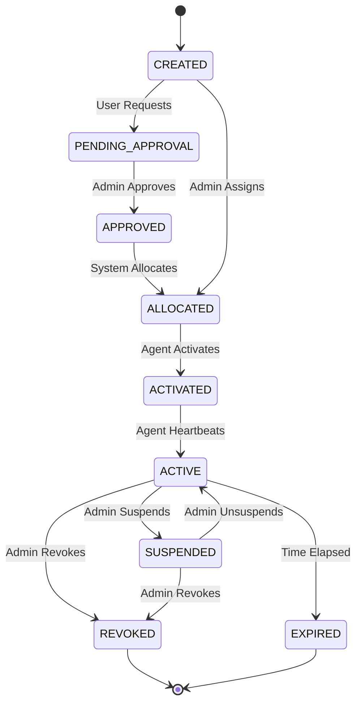

# License Lifecycle

## States

A License transitions through the following states:

1. **CREATED**: The license record exists but is not yet allocated to anyone.
2. **PENDING_APPROVAL**: A request has been made to allocate this license, awaiting admin review.
3. **APPROVED**: The request is approved, but the license hasn't been physically provisioned/allocated.
4. **ALLOCATED**: Assigned to a specific Company/User, ready for activation.
5. **ACTIVATED**: An installation has claimed this license.
6. **ACTIVE**: The installation is actively heartbeating and using the license.
7. **SUSPENDED**: Temporarily disabled by admin; the agent should reject usage.
8. **REVOKED**: Permanently revoked.
9. **EXPIRED**: The license validity period has ended.

## State Transitions

Only specific roles can perform transitions. The API must enforce these rules via a State Machine.

